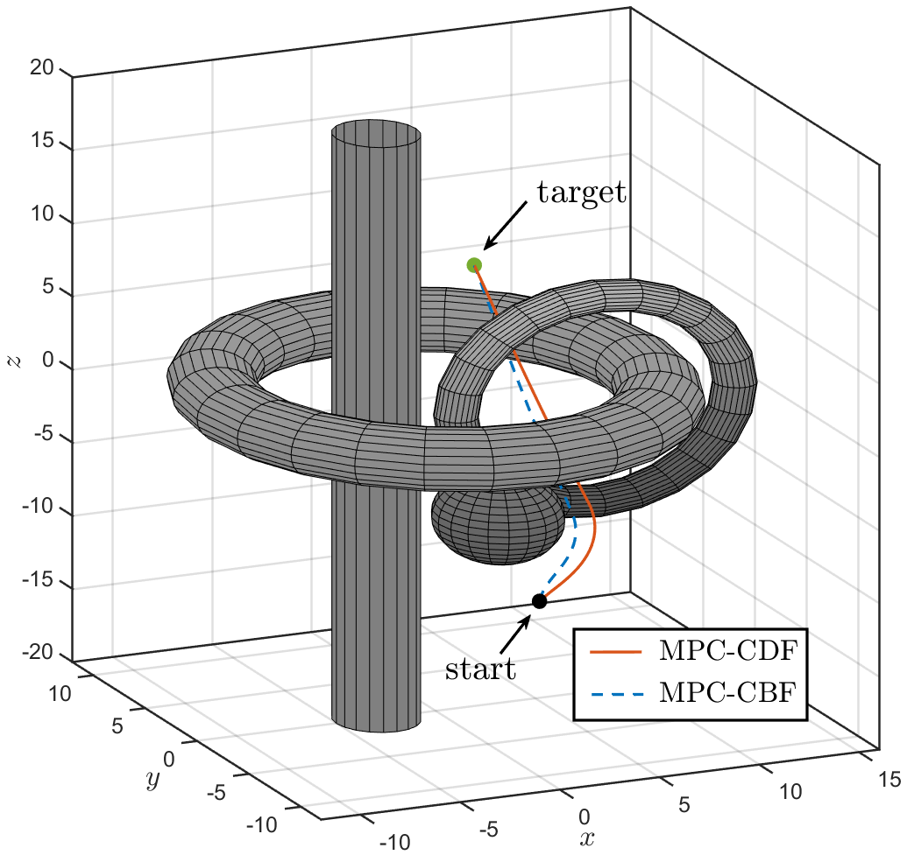

# Safety Critical Model Predictive Control Using Discrete-Time Control Density Functions (MPC-CDF)
This paper presents MPC-CDF, a novel approach integrating density functions within a model predictive control (MPC) framework to ensure safety-critical control in nonlinear dynamical systems via control density functions (CDFs). By using the dual formulation of the navigation problem, we incorporate CDFs into an MPC framework, ensuring both convergence and safety of the underlying nonlinear system. These density functions are endowed with a physical interpretation, where the associated measure signifies the occupancy of system trajectories. Leveraging this occupancy-based perspective, we synthesize safety-critical controllers using the MPC-CDF framework. The efficacy of this approach is demonstrated in achieving a specified level of safety for the autonomous navigation of an underwater vehicle, effectively avoiding complex and arbitrary obstacles.


<!-- Check out our paper on Science Direct: https://www.sciencedirect.com/science/article/pii/S2405896323024242

Here is an Arvix version: https://arxiv.org/abs/2305.03868 -->

## Intuitition behind Contorl Density functions (CDF)

Density functions are a physically intuitive way to solve the safety critical control problem. Specifically, they can represent arbitrary unsafe sets and generate safe trajectories. The corresponding navigation measure has a nice physical interpretation related to occupancy, where the measure of any set corresponds to the occupancy of system trajectories within that set [1]. We illustrate this concept through a simple density function defined for a system with integrator dynamics and a circular unsafe set. In the figure below, the density function representing the circular obstacle is depicted with the corresponding occupancy. Notably, system trajectories exhibit zero occupancy in the unsafe set $X_u$ and maximum occupancy in the target set $X_T$. Thus, by ensuring zero navigation measures on the obstacle set and maximum on the target set, it becomes feasible to guide system trajectories toward the desired target set while circumventing the obstacle set. This occupancy-based density 

<p align="center">

</p>

## MPC-CDF Framework
<p align="center">

</p>

## Applications to an Autonomous Underwater Vehicle (AUV)

Next, we develop an example where we start the AUV system with initial positions along a plane. The objective here is to converge to the target position at $x_T = [0,-1,5]$ while avoiding spherical obstacles of varying sizes ranging from $r_k = [0.75,1,1.25]$. Fig below shows that each trajectory obtained from the proposed MPC-CDF framework converges to the target safely while avoiding obstacles. Note that we use $\alpha=0.1$ and $s_k=1$ when constructing the density function.

<p align="center">

</p>

In this example, we set up a complex underwater environment consisting of two torii, a cylinder and a share. The control task for the AUV is to go to a target position at $x_T = [4,4,8]$ starting from the initial position of $x_0=[0,-10,-8]$ while safely avoiding all the obstacles. In Figure below, the red trajectory is obtained using the proposed MPC-CDF framework (with $\alpha=0.1$ and $s_k = 10$) while the blue trajectory is obtained using MPC-CBF (with $\gamma=0.1$). It can be seen that the MPC-CDF trajectory is safer than the MPC-CBF near the spherical obstacle. Since the construction of the density function is physically intuitive, it is easier to tune the radius of the sensing region $s_k$ to achieve the desired level of safety.

<p align="center">

</p>

## Comparison with control barrier functions (MPC-CBF)

We provide a qualitative comparison between the proposed MPC-CDF framework and the MPC-CBF approach. To this extent, we set up an environment with a circle obstacle of radius $r=1$ centered at $[5,0]$ and use a unicycle dynamics. The objective for this task is to go from the initial position $x_0 = [0,0,0,]$ to a target position of $x_T = [10,0,0,0]$ while avoiding the unsafe set defined by the circular obstacle. In Fig. \ref{fig:cdf_vs_cbf_unicycle}, the trajectories obtained using MPC-CDF are shown using solid lines, and the ones obtained with MPC-CBF are in dashed lines for $s_k=[2,3,4]$ and $\gamma=[0.3,0.5,0.7]$ respectively. For the MPC-CBF, the degree of safety drops drastically between $\gamma=0.3$ and $\gamma=0.5$ due to the exponential nature of the CBF constraint (see blue dashed vs yellow dashed lines). However, for the MPC-CDF, the degree of safety varies more uniformly with $s_k$. Hence, for complex environments with multiple unsafe sets, a desired level of safety can be achieved easily using the proposed MPC-CDF.

<p align="center">

</p>

## Running the code

To use this framework, run the AUV or unicycle examples from the root. For the first example, run ```AUV_mpc_cdf_example1.m``` and for the second example run ```AUV_mpc_cdf_example2.m```.

## References

[1] Vaidya, Umesh. "Optimal motion planning using navigation measure." International Journal of Control 91.5 (2018): 989-998.

[2] Zheng, Andrew*, Sriram SKS Narayanan*, and Umesh Vaidya. "Safe navigation using density functions." IEEE Robotics and Automation Letters (2023).
